# Evaluating and Comparing the Performance of VRI Data and LiDAR-derived Stand Metrics across Different Geospatial Features in MKRF, BC

Project Author: Zijin Xiao

## Introduction:

The Vegetation Resource Inventory (VRI) is a provincial database that records forest metrics across BC with outdated methods (BC Government., n.d.). In the modern context, VRI is no longer an ideal database for stand-level studies. The polygons contain limited information and are prone to overgeneralizing the metrics for the area within a polygon, which is likely due to and introduced by the aggregation and ecological effects (Holt et, al., 2010). However, VRI still actively participates in a lot of fields like estimating carbon stock, disturbance map updating, and various other fields today (Parshakov et. al., 2025; DellaSala et. al., 2022).

In this Study, we compare VRI data (2019&2022) and LiDAR-derived data (2019&2022), both obtained from Malcolm Knapp Research Forest (MKRF). Our goals include: **1. Quantifying the discrepancy between the stand metrics derived from VRI and LiDAR**. We are concerned with stand volume, diameter, species composition, etc., as they tend to exhibit error patterns in different ways potentially. **2. Examining, summarizing, and mapping out any potential pattern of the discrepancy in relation to specific geophysical features.** We expect to observe more errors and/or a larger error range at the border of multiple succession stages or in rough, uneven terrain, as these areas exhibit greater microscale heterogeneity and pose a higher risk of overgeneralization.

## Data + Study Site Summary

### Study Site Summary:

The Malcolm Knapp Research Forest is located in Maple Ridge, BC, Canada. According to UBC Forestry (2025), MKRF is a traditional, ancestral, and unceded territory of the Katzie (q̓ic̓əy̓) First Nation; it has over 51 km2 of coastal forest hectares that fall entirely in the Coast Western Hemlock (CWH) biogeoclimatic zone. Common species also include Douglas-fir and Western red cedar. (UBC Forestry, 2025). The annual average rainfall in MKRF is between 2200 and 3000mm, showing a strong marine climate (UBC Forestry, 2025). MKRF contains a variety of minor topography. It exhibits a general decreasing gradient from the north-east side of the mountain to the south-west lowland (UBC Forestry, 2025). The area will be considered suitable for this research due to its high data availability, complex geomorphology, and sufficiently large study area, enabling the research to produce more precise and representative results regarding the different patterns.

```{r leaflet_1, include = FALSE}
library(dplyr); library(leaflet); library(sf)
StudyArea <- st_read("images/geo_layers/boundaries.gpkg")
StudyArea <- st_transform(StudyArea, 4326)


StudySite <- leaflet() %>%
  addProviderTiles("Esri.WorldImagery") %>%
  addPolygons(data = StudyArea,
              color = "yellow",
              weight = 1,
              fillOpacity = 0.1,
              group = "StudyArea") %>%
  addScaleBar(position = c("bottomleft"))%>%
  setView(-122.5858, 49.3075, zoom = 11.25)
```

```{r map_1, echo=FALSE}
StudySite
```

### Data Summary:

The study will use the VRI data and LiDAR data from 2022, and a supportive boundary file from 2025.

Vegetation Resource Inventory (VRI) data is from the BC Data Catalogue (2022). It provides all stand metrics and one geophysical metric for this study. The selected stand metrics capture stand structure in horizontal, vertical, and volumetric dimensions. We will take the column of canopy density, stand height, live stand volume (trees \>12.5 cm DBH), and vertical complexity into our comparison with those metrics derived from LiDAR. The geophysical metric, surface expression from VRI, adds more details to the geophysical consideration of the study by describing the subsurface structure, composition, and subtle morphology as a whole.

We obtain the LiDAR data through the laser scanner system: RIEGL VQ-1560II (RIEGL Laser Measurement Systems, 2022). Laser pulse repetition rates can be in steps of less than 12. It is also equipped with an IMU/GNSS unit that allows for seamless integration and a 150-megapixel RGB camera. The LiDAR also serves as the base of a series of derived models and raster files. Most of them have a resolution from 0.25m to 1m. Most of them have a resolution from 0.25m to 1m. A resolution of 1m will be chosen for downstream analysis to unify the spatial resolution and speed up data processing.

| Data name | Source | Data type | Resolutions | Derived / Acquired | Theme | Details |
|-----------|-----------|-----------|-----------|-----------|-----------|-----------|
| VEG_COMP_LYR_R1_POLY_2022 | BC Government | Polygon | Depending on polygon size ( from 0.285m^2^ to1.200 | Acquired | Vegetation Resource Inventory | Biomass, Basal Area, Average DBH, Height, etc. |
| boundaries | UBC | Polygon | 50.89km^2^ | Acquired | The boundary of MKRF | N/A |
| ALS_2022 | Long-range airborne laser scanner system RIEGL | Raster | 1m | Acquired | LiDAR data collected over the MKRF region | The raw LiDAR point clouds. |
|  |  |  |  | Derived | CHM | Canopy Height Model |
|  |  |  |  | Derived | DTM | Digital Terrain Models |
|  |  |  |  | Derived | Slope, altitude, TWI | A series of derived raster files from LiDAR |

: Attributes of all adopted data. The table summarizes all data information with its data name, source, data type, resolution, theme, derived/acquired, and other details.

## Method

In general, the study uses statistical methods (Pearson coefficients, R ^2^ ) and maps to explore the potential difference/error pattern that happens between VRI and LiDAR stand metrics in response to geophysical conditions.

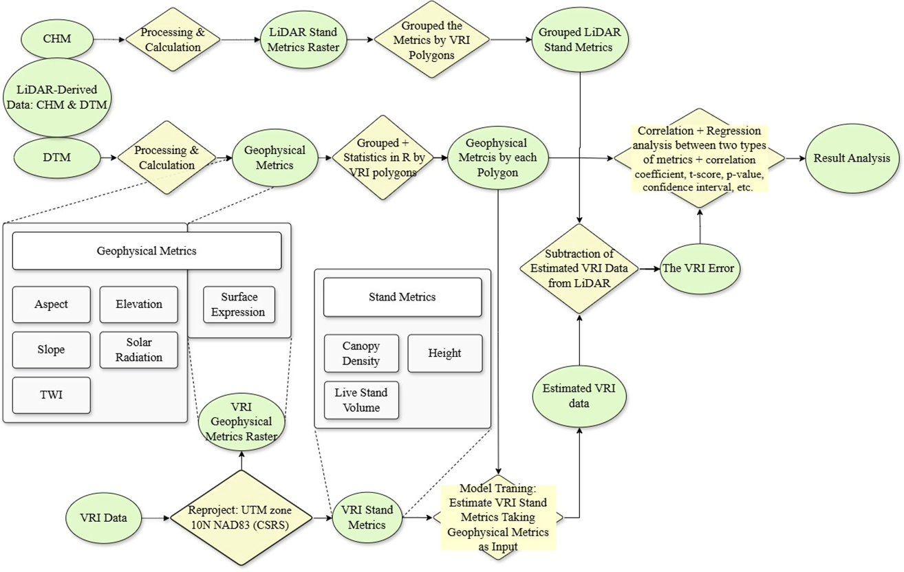

-   Step1: The Pre-Data Processing - Calculated Stand/Geophysical Metrics from LiDAR Clouds

    -   **Height**: Driven from CHM with a 5m threshold (Di Gregorio & Jansen, 2001)

    -   **Canopy Density**: Canopy covered area/ total area with the same threshold applied

    -   **Volume**: Model from Tompalski et al. (2015). The study site of Tompalski et al. (2015)’s research shares similar forest composition and biogeoclimatic conditions (CWHxm) with the MKRF (UBC Forestry, 2025), the model coefficients are considered transferable.

    -   **Geophysical Metrics**: Derived from DEM.

-   Step2: Fitting a Model for VRI Stand Metrics to filter out the Geophysics-Related effect

    -   With all data being processed and metrics being calculated, we are going to explore the relationship between each stand metric and geophysical metrics. However, we cannot assume the VRI stand metrics is entirely correlated to and dependent on the variation of geophysical metrics. After fitting the model, we can use the VRI stand metrics safely to compare with LiDAR-derived metrics.

-   Step3: Calculating the Errors

    -   The Result will be averaged based on the existing polygon, and the overall error will be recorded in %, with each type of stand metric error being equally weighted.

-   Step4: Exploring the Relationship between Each Stand Metrics and Geophysical Metrics.

    -   Starting from paired scatterplots, to Pearson's coefficient, the spatial pattern analysis, etc.

## Result

### The Summary of General Error Pattern & Statistics:

The underestimation of stand metrics tends to be found at the north-west and the south-east portions of the MKRF landscape. The overestimation of stand metrics tends to be found at the middle-to-north central part and the southernmost part of the landscape. This error distribution aligns partially with geophysical metrics like slope, solar radiation, and TWI, and is determined by the combination/proportional contribution of those.

```{r leaflet_2, include = FALSE}
vec <- st_read("images/geo_layers/datasummary5.shp")
vec <- st_transform(vec, 4326)

brks <- quantile(vec$dff_vrl, probs = seq(0, 1, length.out = 10), na.rm = TRUE)
pal1 <- colorBin("RdYlBu", vec$dff_vrl, reverse = TRUE, bins = brks, na.color = "transparent")

overall <- leaflet() %>%
  addProviderTiles("Esri.WorldImagery") %>%
  addPolygons(data = vec,
              fillColor = ~pal1(dff_vrl),
              color = "black",
              fillOpacity = 0.9,
              weight = 0.5,
              group = "ErrorSummary") %>%
  addLegend(data = vec,
            pal = pal1,
            values = ~dff_vrl,
            title = "Overall Error (%)",
            position = "bottomright",
            opacity = 0.8,na.label = NULL) %>%
  addScaleBar(position = c("bottomleft")) %>%
  setView(-122.5859, 49.3075, zoom = 11.5)
```

```{r map_2, echo=FALSE}
overall
```

Three stand metric errors are normalized and weighted equally to get the overall error pattern. Significant error is shown by a more intense color, while less significant error is represented by light red/blue/yellow.

```{r leaflet_3, include = FALSE}
brks <- quantile(vec$dff_CDn, probs = seq(0, 1, length.out = 6), na.rm = TRUE)
pal2 <- colorBin("RdYlBu", vec$dff_CDn, reverse = TRUE, bins = brks, na.color = "transparent")
brks <- quantile(vec$diff_he, probs = seq(0, 1, length.out = 6), na.rm = TRUE)
pal3 <- colorBin("RdYlBu", vec$diff_he, reverse = TRUE, bins = brks, na.color = "transparent")
brks <- quantile(vec$diff_vl, probs = seq(0, 1, length.out = 6), na.rm = TRUE)
pal4 <- colorBin("RdYlBu", vec$diff_vl, reverse = TRUE, bins = brks, na.color = "transparent")


breakdown <- leaflet(data = vec) %>%
  addProviderTiles("Esri.WorldImagery") %>%
  addPolygons(group = "CanopyDensityError",
              fillColor =  ~pal2(dff_CDn),
              fillOpacity = 1,
              color = "black", weight = 0.25) %>%
  addPolygons(group = "HeightError",
              fillColor =  ~pal3(diff_he),
              fillOpacity = 1,
              color = "black", weight = 0.25) %>%
  addPolygons(group = "VolumeError",
              fillColor =  ~pal4(diff_vl),
              fillOpacity = 1,
              color = "black", weight = 0.25) %>%
  addLayersControl(
    baseGroups = c("CanopyDensityError","HeightError","VolumeError"),
    options = layersControlOptions(collapsed = FALSE)
  ) %>%
  addLegend(pal = pal2, 
            values = ~dff_CDn, 
            title = "CanopyDensityError(%)", 
            position = "bottomleft", 
            opacity = 0.8,na.label = NULL) %>%
  addLegend(pal = pal3,  
            values = ~diff_he, 
            title = "HeightError(m)",       
            position = "bottomright",    
            opacity = 0.8,na.label = NULL) %>%
  addLegend(pal = pal4,  
            values = ~diff_vl, 
            title = "VolumeError(m³)",       
            position = "bottomleft", 
            opacity = 0.8,na.label = NULL) %>%
  addScaleBar(position = c("bottomleft")) %>%
  setView(-122.5859, 49.3075, zoom = 11.5)
```

```{r map_3, echo=FALSE}
breakdown
```

The breakdown of three different types of standard error. Significant error is shown by a more intense color, while less significant error is represented by light red/blue/yellow.

### **Expected Error Pattern in Response to Geophysical Metrics:**

The statistics result reflects a consistent pattern where canopy density error is least likely to be affected by geophysical factors, while height density is right at the opposite. Slope, potential solar radiation, and TWI are the geophysical factors that are most likely to drive a stand metric error. The relationship is not only illustrated by the Pearson's coefficient and scatterplots, but also validated by better model fitness and model error behavior. However, it is important to note that the adopted linear models here are not the best model to fit all types of relationships. The point here is to use an efficient statistic model showing a general pattern between each pair of stand/geophysical metrics.

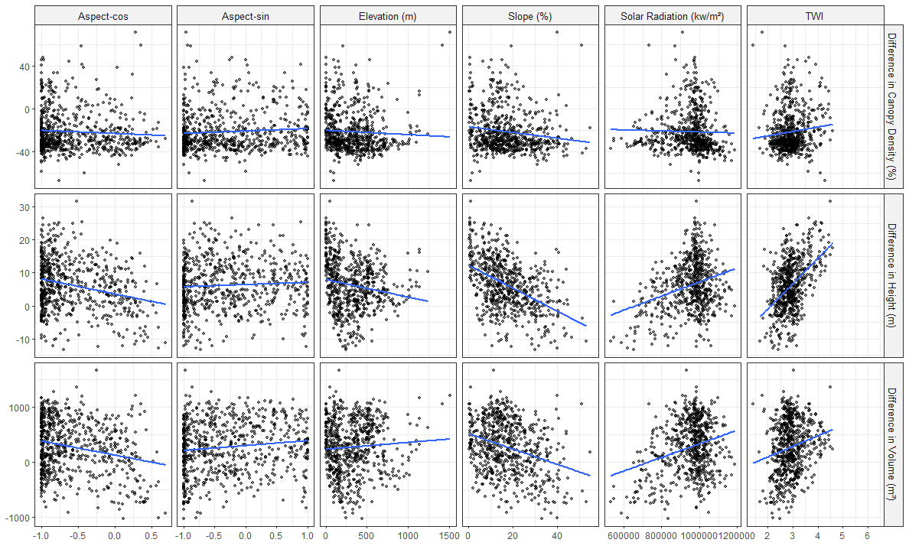

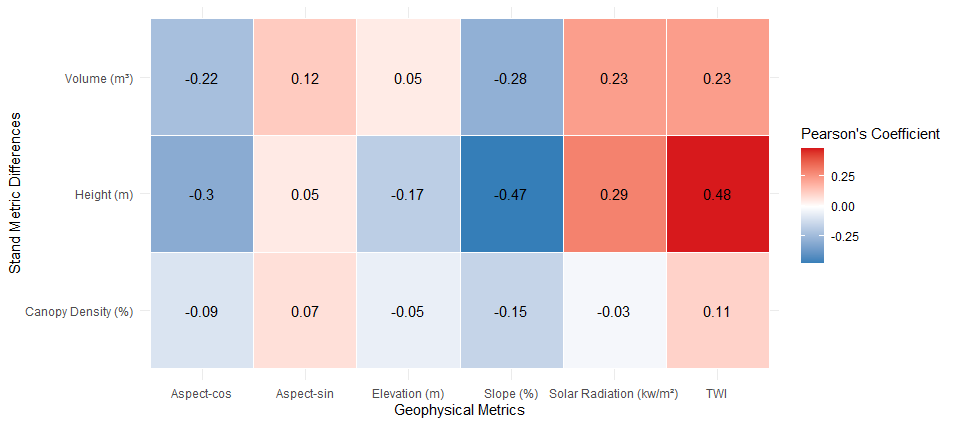

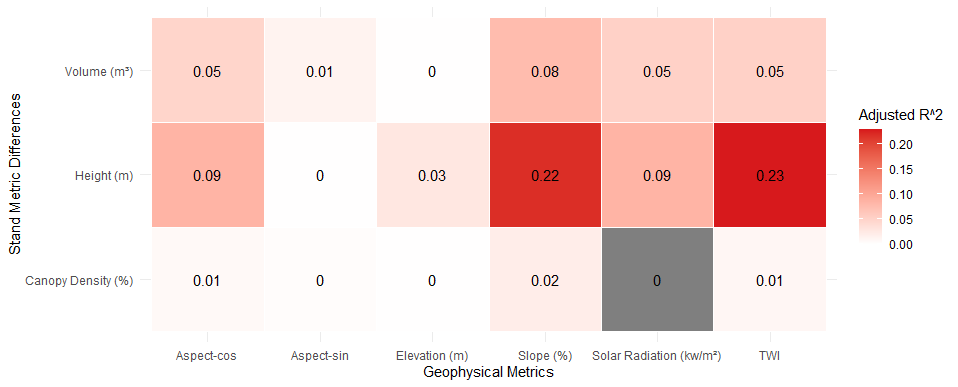

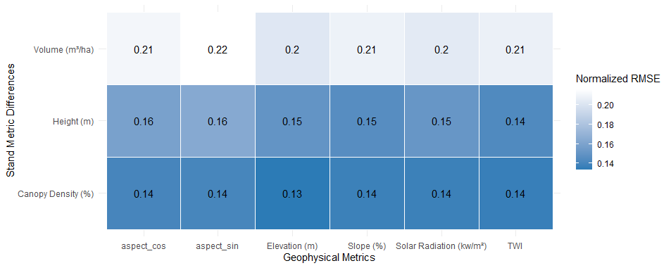

### Expected Error Pattern in Response to Surface Expression:

Plain shows more bias in canopy density and height, but shows the least bias in volume. This is contradictory to our first expectations, where the error of plain should be the lowest across all types of errors. It can be explained by the fact that unclassifiable polygons (None) constitute the vast majority of the MKRF. The remaining three categories each contain only dozens of data points, significantly increasing uncertainty and bias. Therefore, the research on stand metric error based on surface expressions should ideally select more diverse study areas.

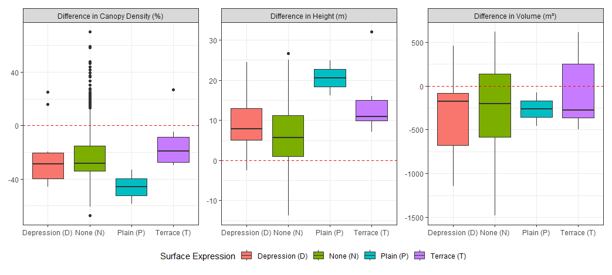

### **The Summary of Spatial Error Distribution Pattern in Relation to Geophysical Metrics:**

Here, we offer two sets of ways to explore the relationship between stand metrics and geophysical metrics spatially.

1\) By lining up different geophysical metrics below the error pattern:

::: panel-tabset
## Slope

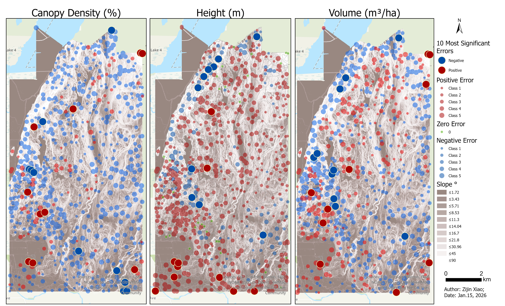{width="100%"}

## Potential Radiation

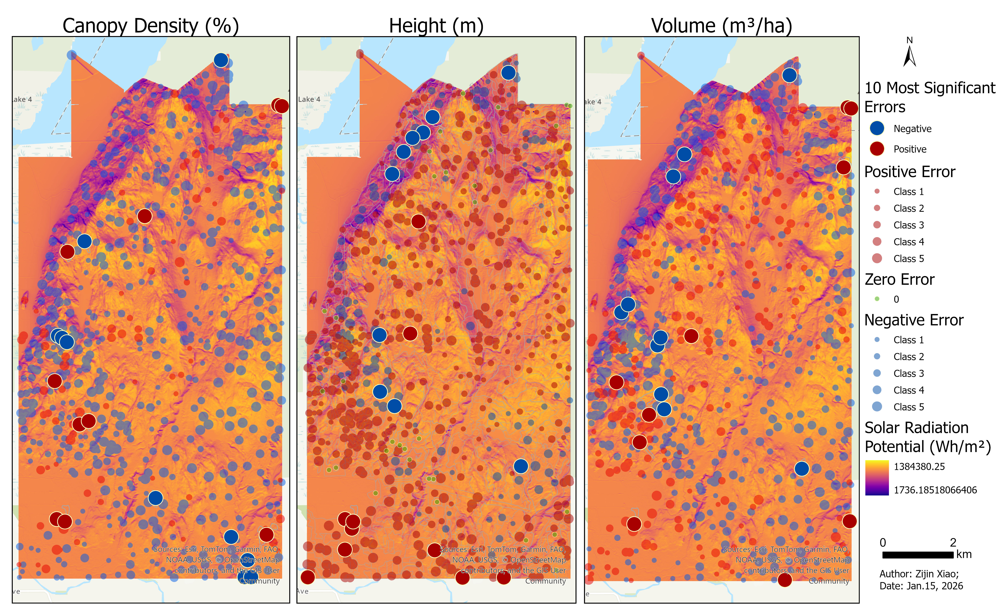{width="100%"}

## TWI

{width="100%"}
:::

or 2) visualizing the relationships themselves (high/low stand error - high/low geophysical metric value) with bivariate choropleths:

::: panel-tabset
## Slope

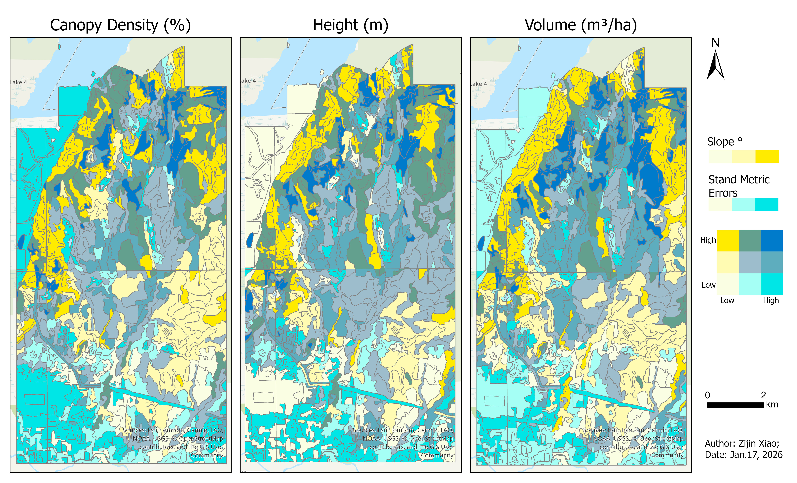{width="100%"}

## Potential Radiation

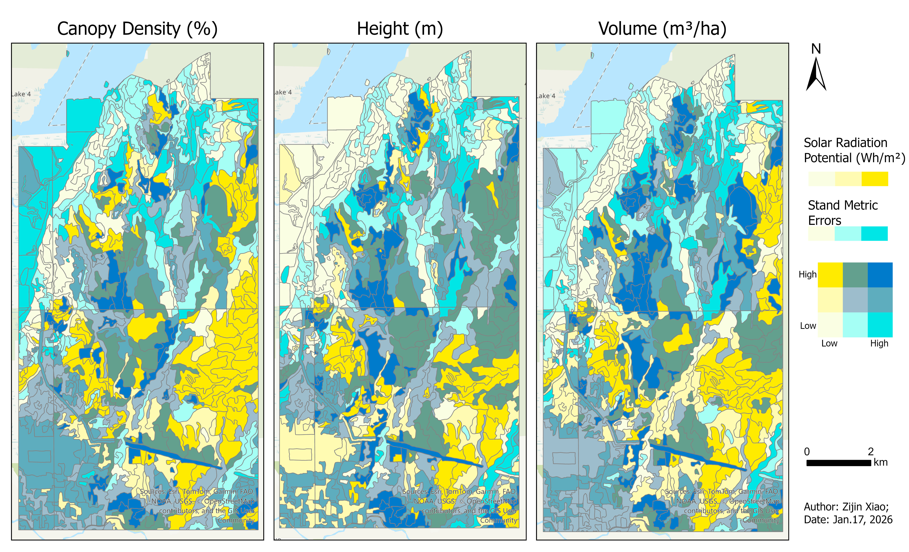{width="100%"}

## TWI

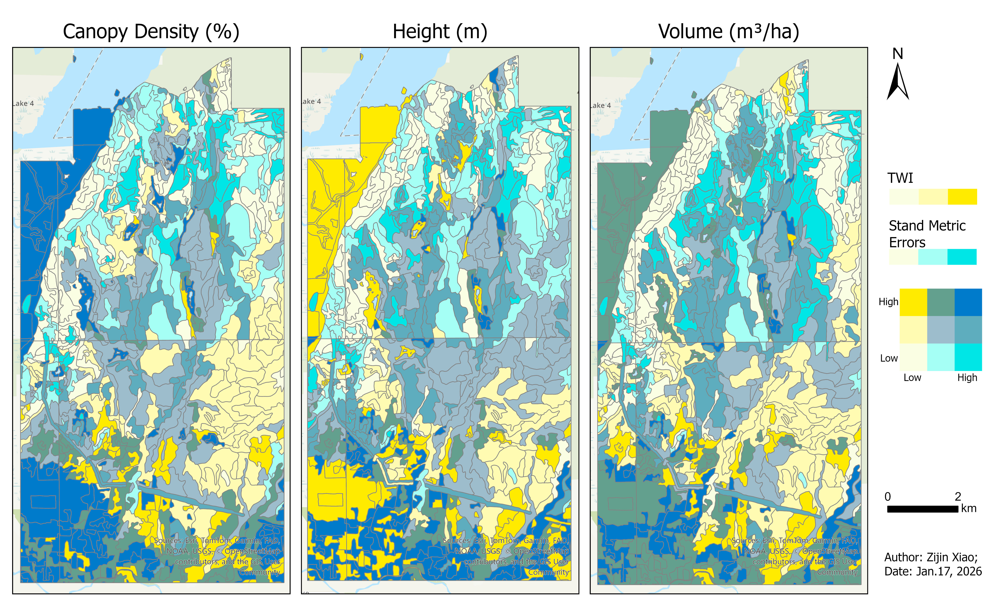{width="100%"}
:::

They both prove the general tendency where underestimation is more likely to be found on the steep north-west facing slope of MKRF, preferably with low TWI across all types of stand metric errors. Overestimation is more likely to be found on the gentle slope where potential solar radiation accumulates, and TWI is high. However, this pattern is more obvious and intuitive on the proportional dot maps than on the bivariate maps, which is also reasonable. The relationship is expressed by the given polygons, which overlook numerous potential subtle topographical variations, and the observed pattern is not robust enough to disregard the presence of confounding variables.
