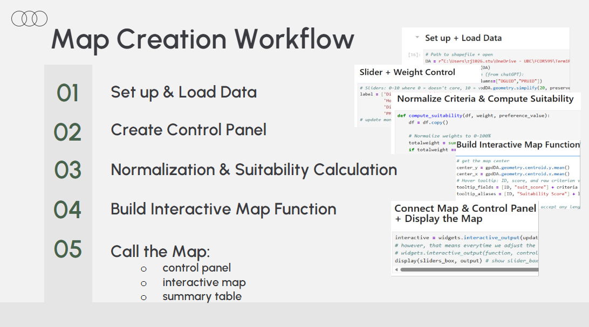

# Project 2 - Remote Sensing Used in Smart Urban Settings​

Project Author: Zijin Xiao; ​Kelvin Lee; Xuan Dong; Willa Pepin​; Hengyin Liao

## Possible Applications of Remote Sensing in Smart City Settings​

### Remote Sensing for Urban Temperature Monitoring

TIR (Thermal Infrared) temperature refers to the measurement of land surface temperature using thermal infrared bands. Thermal Infrared (TIR) satellite example includes Landsat 8/9 TIRS (Band 10, Res 100m, 16-day revisit)​ & ECOSTRESS (ISS) (TIR, RES 70m, diurnal heat patterns), etc.

The satellite sensor measures top-of-atmosphere spectral radiance in the thermal infrared band first. Then we convert the radiance into brightness temperature(BT) using Planck's law. BT stands for the temperature of a blackbody that would emit the measured radiance. The last step is to calibrate these results based on the surface type for the real land surface temperature (LST).

This means a lot to a smart city in combat with higher health risk​ due to increasing heatwave frequency and intensity. It also reflects the energy demand pattern.

### Remote Sensing for Urban Greenness Monitoring​

Urban greening levels are typically evaluated using a variety of indices, such as the Normalized Difference Vegetation Index (NDVI). The Enhanced Vegetation Index (EVI) is a refined version of NDVI that incorporates additional adjustments for soil and atmospheric effects.

A city can do a lot with Greenness:

-   Improves air quality​ & energy efficiency​ and reduces climate risks​

-   Increases urban attractiveness and quality of life

-   Identify where green infrastructure is lacking​

-   Monitor sustainable urban growth​

-   Support smart-city environmental policy decisions

### Remote Sensing for Urban Air Quality Monitoring​

This is a promising field, as current air pollution monitoring largely relies on ground stations. Remote sensing data provides more precise and continuous air quality information.

Satellites can predict air quality by detecting atypical refraction/scattering of pollutants in the atmosphere across specific spectral bands. Consequently, NDVI, spectral ratios, and TOA reflectance can all infer relative aerosol concentration/pollution loading.

### Remote Sensing for Detecting Radiation Receiving (Sunlight)​​

Geostationary satellites measure narrow band reflectance at the top of the atmosphere, which is converted into broadband TOA albedo, then matched with radiative transfer lookup tables to estimate atmospheric transmittance based on airborne particles and surface properties. Using this transmittance, the algorithm calculates Surface Solar Irradiance (SSI), representing the amount of solar radiation reaching the ground.

## Incorporate the Applications in Finding the Most Livable Place in the Great Vancouver​

Our goal is to use a multi-criteria interactive map to identify the most livable places in Greater Vancouver.​

Several remote sensing applications introduced earlier—such as surface temperature, vegetation conditions, air quality–related indicators are integrated into our map as part of the decision-making factors.​ These datasets are combined with other environmental and urban indicators, normalized to a comparable scale, and then used to calculate a livability score.

### Metric Introduction/Creation Workflow:

+---------------------------+-------------------------------------------------+
| Distance to Amenities     | Distance to CBD (Central Business District) (m)​ |
|                           |                                                 |
|                           | Distance to Public Transportation Stations (m)​  |
|                           |                                                 |
|                           | Distance to Nearest School (m)​                  |
|                           |                                                 |
|                           | Distance to Hospital (m)                        |
+---------------------------+-------------------------------------------------+
| Environment               | Distance to Seashore (m)​                        |
|                           |                                                 |
|                           | Green Density​                                   |
|                           |                                                 |
|                           | Surface Temperatrue (°C)​                        |
|                           |                                                 |
|                           | PM2.5 Concentration (μg/m³)                     |
+---------------------------+-------------------------------------------------+
| Price                     | Owned House Maintainance fee (\$)​               |
|                           |                                                 |
|                           | House Rent (\$)                                 |
+---------------------------+-------------------------------------------------+
| Neighborhoods / Neighbors | Population Density​                              |
|                           |                                                 |
|                           | Percentage of Bachelor Degree Holders​           |
|                           |                                                 |
|                           | Age​                                             |
|                           |                                                 |
|                           | Unemployment Rate​                               |
|                           |                                                 |
|                           | Median Income (\$)                              |
+---------------------------+-------------------------------------------------+
| Social Instability Factor | Crime Rate                                      |
+---------------------------+-------------------------------------------------+

### Map Creation Workflow

:::::: columns
::: {.column width="40%"}
 
 
1.  Set up & Load Data
2.  Create Control Panel​
3.  Normalization & Suitability Calculation​
4.  Build the Interactive Map Function​
5.  Call the Map:​
    -   control panel​

    -   interactive map​

    -   summary table​
:::

::: {.column width="3%"}
:::

::: {.column width="57%"}
{width="100%"}

ps: the workflow was first conducted in python using folium/ipywidgets, etc.
:::
::::::

### Instruction:

-   Weight control:

    -   Each Metric is Weighted from 1-10, with a step of 1. You can Drag & Drop to control the weight!

    -   The weights will be normalized by: $\frac{\text{Metric}}{\text{Sum of All Metric Values}}$

    -   All 10 = All 1 = Equally weighted

-   Toggle Options​:

    -   Let users define what is preferable

    -   If 'Lower is better' is on: $\frac{\text{DA } Value_{max} - \text{DA Value}}{\text{DA } Value_{max} - \text{DA } Value_{min}}$

    -   If 'Higher is better' is on: $\frac{\text{DA Value} - \text{DA } Value_{min}}{\text{DA } Value_{max} - \text{DA } Value_{min}}$

-   Summary Table:

    -   The table summarizes the 10 most livable dissemination areas

### Check the interactive map below:

<iframe src="https://zijin-xiao.shinyapps.io/DA_Suitability_Explorer_v2/" width="100%" height="700px" style="border:none;">

</iframe>

## Summary:

This project is an excellent example of integrating remote sensing technology with multiple data sources and file types, applying in the smart city setting. Its significant potential for further development originates from two key factors: 1) the renovation of remote sensing technology, such as utilizing LiDAR to generate more detailed DEM models; and 2) the growing demand for geographic information in urban areas, coupled with increasingly constrained land use, making the remote acquisition of large volumes of data particularly crucial.
