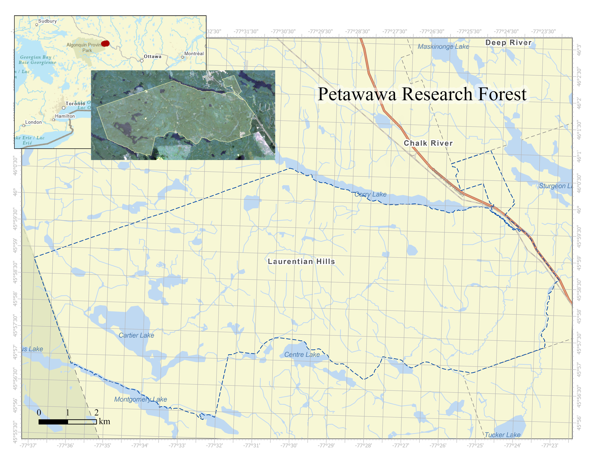
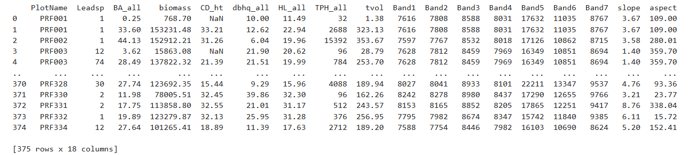
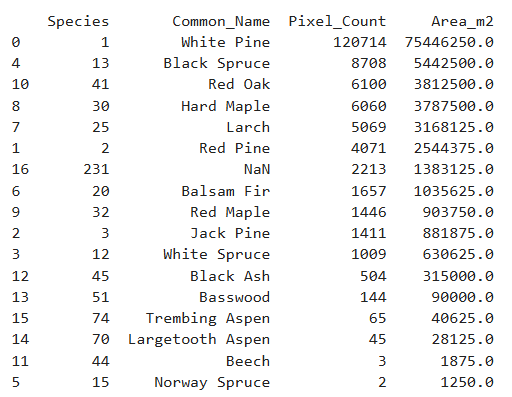
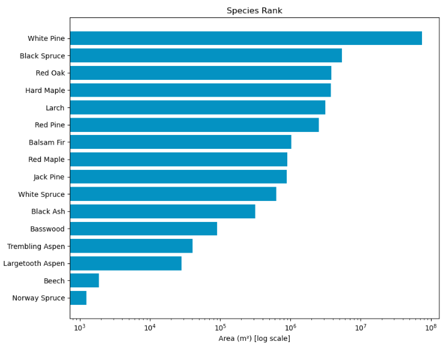
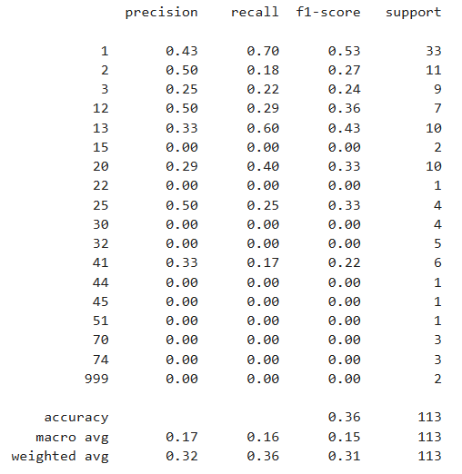
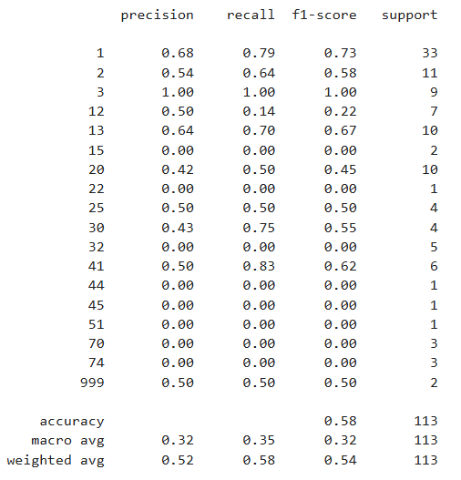

Project Author: Zijin Xiao, Kate McIntyre, Nathan Mital, Abdiqafar Mohamed,

# **Background & Motivation**​

This project models dominant tree species across the Petawawa Research Forest (PRF) using Multi-spectral remote sensing imagery, Airborne Laser Scanning (ALS) data and Python-based analytical tools.

Traditionally, the identification of species relies on the multi-spectral remote sensing imagery. Predicting dominant species from ALS alone remains challenging because ALS sensors generally record a single laser wavelength. However, recent studies indicate that canopy structure and vertical profile metrics derived from ALS point clouds can support effective species discrimination. Michałowska and Rapiński (2021) provide a comprehensive assessment of ALS-based classification methods, noting that classifiers such as Random Forest, Support Vector Machine, and neural networks can achieve accuracies between 70% and over 90%. Similarly, features such as height percentiles, canopy structural indices, and intensity metrics have shown strong discriminatory capability (Fassnacht et al., 2016). This paper primarily explores the potential and feasibility of LiDAR data for species classification.

## Major Questions to Solve

-   Can airborne LiDAR (ALS) data be used to accurately predict dominant tree species at the stand level in the Petawawa Research Forest?

-   Is LiDAR data alone sufficient for species classification, or would adding multi-spectral data improve model performance?

# Data + Study Site Summary

## Study Site Summary:

The PRF, located in Ontario near the Quebec border about 200 km northwest of Ottawa, offers an ideal test environment (Figure 1). Established in 1918, it is Canada’s oldest continuously operated research forest and spans roughly 100 km² within the Great Lakes–St. Lawrence mixedwood region (White et al., 2020). Its long-term ecological monitoring program includes ALS acquisitions from 2012 and 2018. Common species in the forest include white pine (Pinus strobus), red oak (Quercus rubra), trembling aspen (Populus tremuloides), white birch (Betula papyrifera), red pine (Pinus resinosa), and maple (Acer spp.).



## Data Summary:

|  |  |  |
|----|----|----|
|  | **Data Source** | **Metrics Breakdown** |
| **LiDAR** | Terrain Metrics: PRF Digital Terrain Model | Aspects; Slope |
|  | Stand Metrics: PRF Enhanced Forest Inventory datasets | Basal Area; Above ground Biomass; Height of Dominant Species; DBH; Stand Density; Gross Total Volume |
| **Multi-Spectral Images:** | Landsat 8 | Band 2 (Blue); Band 3 (Green); Band 4 (Red); Band 5 (NIR); Band 6 (SWIR1); Band 7 (SWIR2) |
| **Ground Plots:** | Field Trip | Tree Species; Ground Plot Vectors |

# Method

**1. Set up and Prepare Landscape Data (LiDAR/Multi-Spectral Images)**

-   Load and process landscape data (metrics)

**2. Prepare Ground Plot Data**

-   Load and process ground plot data (training/validation data)

    -   Topography: extract the value by ground plot polygons from the landscape DTM data that we launched in step 1

    -   Stand Metrics: unpack the csv to get the metrics

    -   Multi-Spectral Landsat 8 images: extract the value by ground plot polygons from the 6 bands that we launched in step 1

**3. Get the Training Data Ready**

-   Combine all the ground plot data (topography, stand, and multispectral bands) into one composite dataframe

    -   This will be the dataframe we use to train our model

{fig-align="center"}

**4. Develop a Composite Landscape Map (each layer = one metric)**

-   Making a composite landscape map that contains all metrics as layers

``` python
# probably need to restart the kernel for arcpy
composite_input = [basal_area, biomass, height_dominant, DBH, height,stand_density,volume] + in_rasters + in_topo
arcpy.management.CompositeBands(composite_input, r'C:\Users\zj1026.stu\OneDrive - UBC\GEM530\ProjectPresentation\Validation_presentation\composite.tif')
# Read the composite raster
with rasterio.open(r'C:\Users\zj1026.stu\OneDrive - UBC\GEM530\ProjectPresentation\Validation_presentation\composite.tif') as src:
    bands = src.read()  # shape: (16, rows, cols)
    profile = src.profile
arcpy.CheckInExtension("Spatial")
```

**5. Model Developing**

-   Import Random Forest Model Classifier

-   Reclassify the rows: if the leading species has ground plots less than 3, then assign the entire leading species group into species ID 999 (Others) to avoid errors

-   Define the predictor (independent variable, x) as all metrics we just defined above and the dependent variables (y) as the new leading species ID

-   Split the input dataframe by 7:3, so we have 70% of ground plots for training while the rest 30% are for validation.

-   Build up the model

-   Produce validation table

``` python
# the environment doesn't allow for loading both arcpy&sklearn package, so restart kernel before heading into this
from sklearn.ensemble import RandomForestClassifier
from sklearn.model_selection import train_test_split
from sklearn.metrics import classification_report

# remove the species that are so rare that the model cannot even work with.
species_count = train_valid['Leadsp'].value_counts()
rare_species = species_count[species_count < 3].index
train_valid['Leadsp_modified'] = train_valid['Leadsp'].replace(rare_species, 999)

# Predictor variables (multi-spectral bands + topography metrics + stand metrics)
x = train_valid[tree_metric].values
# Dependent variable (species, also from ground plot stand metric data)
y = train_valid['Leadsp_modified'].values

# Split into train/validation
x_train, x_val, y_train, y_val = train_test_split(x, y, test_size=0.3, random_state=42, stratify=y)

# Train the model
rf = RandomForestClassifier(n_estimators=400, random_state=42, class_weight="balanced")
rf.fit(x_train, y_train)
# Validation in Figure&Table discussion section
y_pred = rf.predict(x_val)
print(classification_report(y_val, y_pred))
```

**6. Apply the Model to the Composite Landscape Map**

-   Modify the raster shape for the model

-   Apply the Model and reshape the raster back to original format

-   Save the output map as a categorical raster

``` python
# Reshape to [n_pixels, n_bands]
rows, cols = bands.shape[1], bands.shape[2]
stacked = bands.reshape(15, -1).T  # shape: (n_pixels, 15)

# Predict species for each pixel
predicted_species = rf.predict(stacked) # model expect (n_samples, n_features)

# Reshape predictions back to raster shape
classified = predicted_species.reshape(rows, cols) #shape: (n_bands, row, col)

# Update profile for single-band classified raster
profile.update(count=1, dtype=rasterio.uint8, nodata = 0)

# Save the output
out_class = r'C:\Users\zj1026.stu\OneDrive - UBC\GEM530\ProjectPresentation\Validation_presentation\classified_species.tif'
with rasterio.open(out_class, 'w', **profile) as dst:
    dst.write(classified.astype(rasterio.uint8), 1)
```

**7. Final Map & Summary Table Development**

-   Calculate the area to show the dominance as a dataframe

**8. Output Presentation**

-   Visualization of all tables and map!

    -   Original training dataset

    -   Classified map

    -   Dominance summary table

    -   Validation Table

# Result

## Mapping the Dominant Species:

We expect that from our methods that we will be able to develop a province-wide map of dominant tree species. The dominant species in the PRF were successfully identified and visually displayed by the map below showing the distribution of dominance across the area of study.

{fig-align="left"}

{fig-align="left"}


## Is LiDAR Data Alone Sufficient for Species Classification:

We expect that the combination of LiDAR and spectral imagery will allow for a higher accuracy in differentiation between tree species and have provided example code to prove this. This will be much more suitable for applying to a cross-province species detection program.

::: panel-tabset
## ALS-Only



## Multi-Spectral Images + ALS


:::

# **Challenges & Limitations**

-   Rare Species: Some species were dropped from the model as they were too statistiscally insignficant. Furthermore, there may be species not found in PRF that are found elswhere in Ontario, thus not being accounted for in the model.

-   The training data set is not big enough

-   Because this analysis uses polygons that represent the most dominant tree species within, the ratio of dominance is not known. Using single tree values would allow for a better understanding of the proportion of dominant tree species versus "other" in the area of study.

-   Multispectral imagery has very coarse spatial resolution (Landsat-8), which means our model is limited as it cannot capture the fine spatial and spectral resolution. Landsat-8 was chosen because it is very accessible in North America.

-   The mask can be added to prevent the misclassification of water, barren land, or other special terrain types.

# **References**

• Natural Resources Canada (2025). Petawawa Research Forest (PRF) Open Data Portal. [https://opendata.nfis.org/mapserver/PRF.html](https://www.google.com/url?q=https%3A%2F%2Fopendata.nfis.org%2Fmapserver%2FPRF.html)

• Fassnacht, F. E., Latifi, H., Stereńczak, K., Modzelewska, A., Lefsky, M., Waser, L. T., Straub, C., & Ghosh, A. (2016). Review of studies on tree species classification from remotely sensed data. Remote Sensing of Environment, 186, 64–87. [https://doi.org/10.1016/j.rse.2016.08.013](https://www.google.com/url?q=https%3A%2F%2Fdoi.org%2F10.1016%2Fj.rse.2016.08.013)

• Michałowska, M., & Rapiński, J. (2021). A review of tree species classification based on airborne LiDAR data and applied classifiers. Remote Sensing, 13(3), 353. [https://doi.org/10.3390/rs13030353](https://www.google.com/url?q=https%3A%2F%2Fdoi.org%2F10.3390%2Frs13030353)

• White, J. C., Chen, H. Z., Woods, M. E., Low, B., & Nasonova, S. (2019). The Petawawa Research Forest: Establishment of a remote sensing supersite. The Forestry Chronicle, 95(4), 149–159. [https://doi.org/10.5558/tfc2019-024](https://www.google.com/url?q=https%3A%2F%2Fdoi.org%2F10.5558%2Ftfc2019-024)

• White, J. C., Coops, N. C., Wulder, M. A., Vastaranta, M., Hilker, T., & Tompalski, P. (2016). Remote sensing technologies for enhancing forest inventories: A review. Canadian Journal of Remote Sensing, 42(5), 619–641. [https://doi.org/10.1080/07038992.2016.1207484](https://www.google.com/url?q=https%3A%2F%2Fdoi.org%2F10.1080%2F07038992.2016.1207484)

• White, J. C., Wulder, M. A., Varhola, A., Vastaranta, M., Coops, N. C., Cook, B. D., Pitt, D., & Woods, M. (2013). A best practices guide for generating forest inventory attributes from airborne laser scanning data using an area-based approach. The Forestry Chronicle, 89(6), 722–723. [https://doi.org/10.5558/tfc2013-132](https://www.google.com/url?q=https%3A%2F%2Fdoi.org%2F10.5558%2Ftfc2013-132)

• Government of Ontario Ontario. (1994). Crown Forest Sustainability Act, S.O. 1994, c. 25. Retrieved from [https://www.ontario.ca/laws/statute/94c25](https://www.google.com/url?q=https%3A%2F%2Fwww.ontario.ca%2Flaws%2Fstatute%2F94c25)
