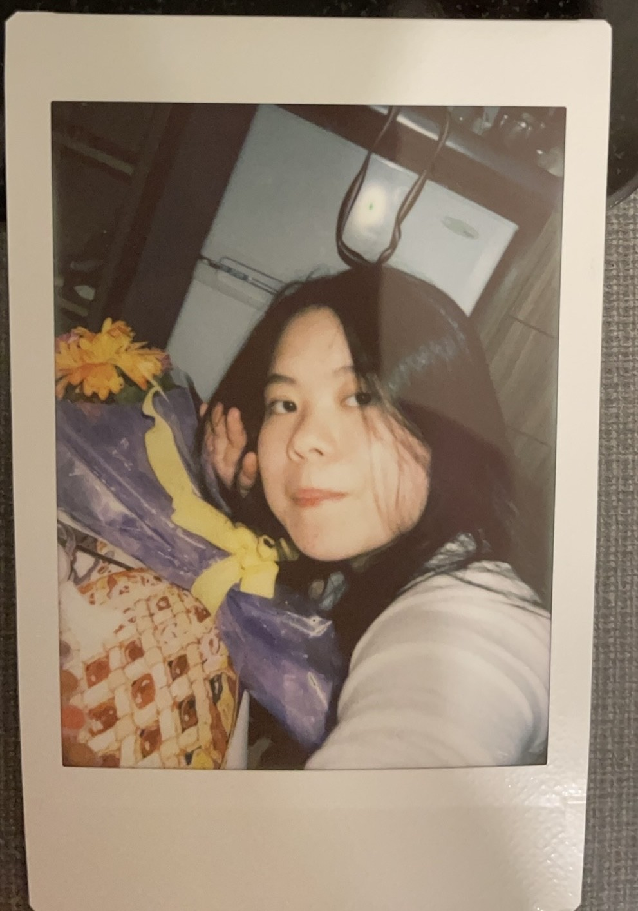
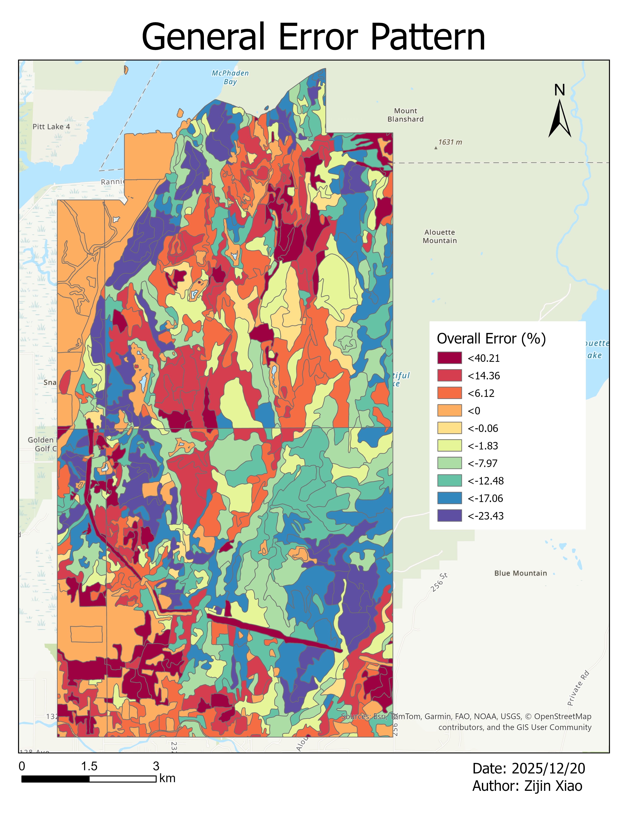
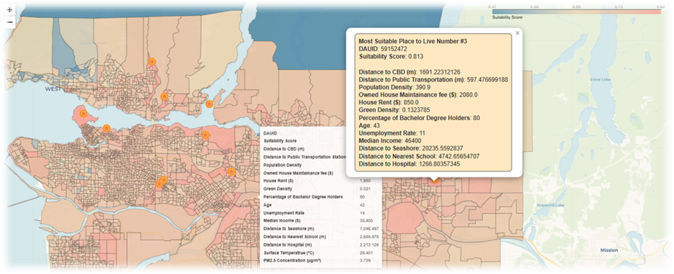
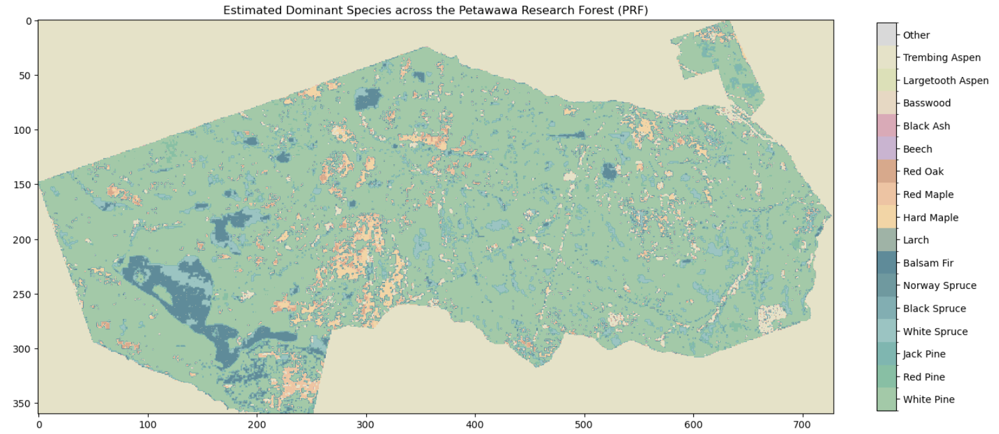

---
format:
  html:
    theme: superhero
    css: styles.css
    include-in-header:
      - text: |
          <link rel="stylesheet" href="https://cdn.jsdelivr.net/npm/bootstrap-icons@1.11.3/font/bootstrap-icons.css">
---

```{=html}

<div class="top-section">
  <div class="intro-left">
    

    <h1>Zijin(Sarah) Xiao</h1>

    <div class="social-icons">
    <a href="https://linkedin.com/in/YOURPROFILE" target="_blank">
    <i class="bi bi-linkedin"></i>
    </a>
    
    <a href="https://github.com/YOURPROFILE" target="_blank">
    <i class="bi bi-github"></i>
    </a>
    
    <a href="xiaozijin2024@gmail.com">
    <i class="bi bi-envelope"></i>
    </a>
    </div>
    
  </div>

  <div class="intro-right">
    <p>
      <h3>Hi There,</h3>
    </p>
    
    <p>
      I am a new Master graduate from UBC Master of Geomatics for Environmental Management (MGEM) program and ready to participate and contribute to my future workplace!
    </p>
    
    <p>
      With past 5 years of study in Geography and GIS-related field, I am confident to show I have gotten strong analytical and critical thinking skills, specializing in data visualization and cartographic design. Proficient in a wide range of geospatial software, office tools and picture editing platforms, including ESRI, ArcGIS Pro, QGIS, Microsoft Office Suite, Adobe Illustrator, etc. Proficient in coding with Python and R for geospatial data analysis, automation, and statistical modeling. Demonstrated strengths in multitasking, time management, and team collaboration, with a proven ability to work efficiently in project-oriented environments.
    </p>
  </div>
</div>
```

## Projects

In these five years, I have also participated in numerous projects related to remote sensing, programming, and GIS. You can explore the "Map Gallery"/Project Conetent" section for further details, or access the content with the links below:

```{=html}
<div class="project-grid">

  <a href="content_1.html" class="project-card">
    <div class="project-image-wrap">
      
    </div>
    <div class="project-card-body">
      <div class="project-card-title">Project 1</div>
      <div class="project-card-text">
        Evaluating and Comparing the Performance of VRI Data and LiDAR-derived Stand Metrics across Different Geospatial Features in MKRF, BC
      </div>
    </div>
  </a>

  <a href="content_2.html" class="project-card">
    <div class="project-image-wrap">
      
    </div>
    <div class="project-card-body">
      <div class="project-card-title">Project 2</div>
      <div class="project-card-text">
        Remote Sensing Used in Smart Urban Settings
      </div>
    </div>
  </a>

  <a href="content_3.html" class="project-card">
    <div class="project-image-wrap">
      
    </div>
    <div class="project-card-body">
      <div class="project-card-title">Project 3</div>
      <div class="project-card-text">
        Proposing a Method for Mapping Tree Species Across the Petawawa Research Forest Using LiDAR for Forest Inventories
      </div>
    </div>
  </a>

</div>
```
