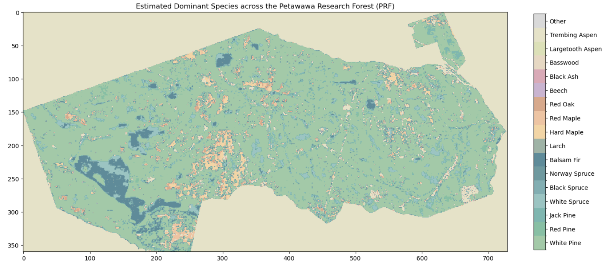
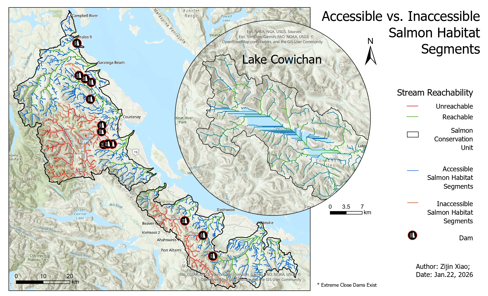
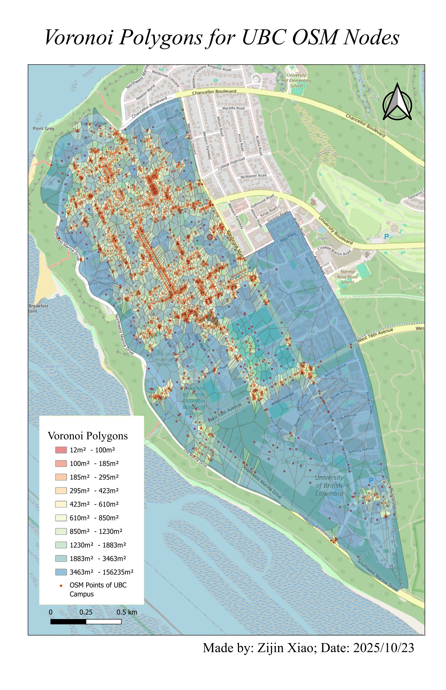
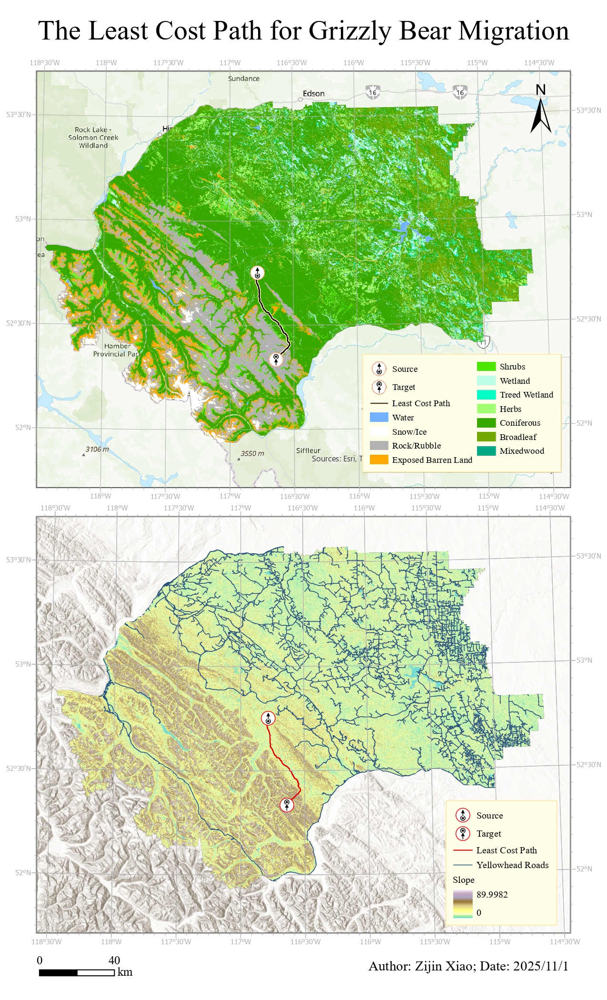
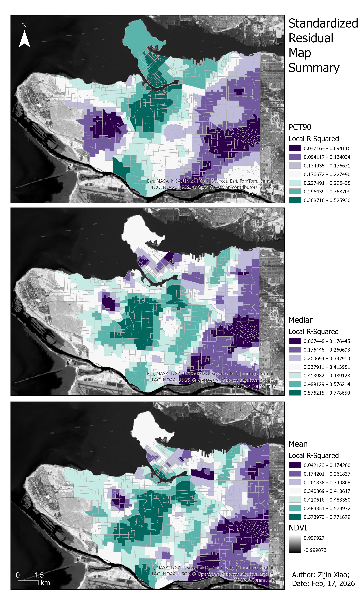
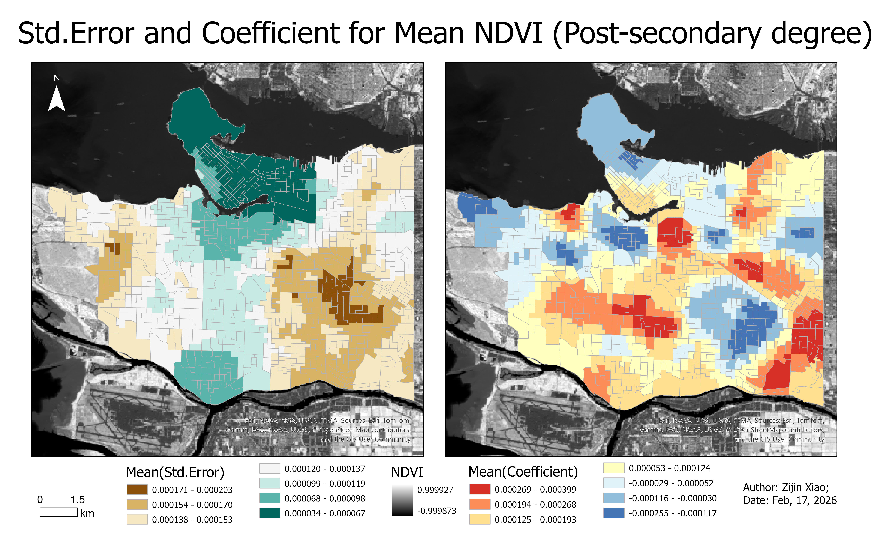
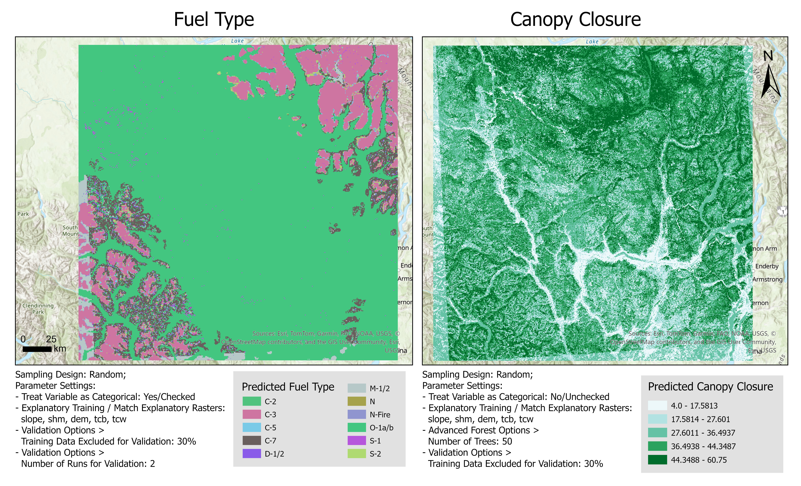

<h2>[Image design for reference:]{.text-primary}</h2>

All images are intended for academic purposes, thus prioritizing static
maps. Aesthetically, they favor simplicity, high recognizability, and
dense information content.

 

<h2>[Proposal of examining The Species Composition of Petawawa Research
Forest]{.text-primary}</h2>

This project utilizes airborne laser scanning (ALS) data and provided
climate databases, combined with Python-based Classification tools
(sklearn-RandomForestClassifier), to rank dominant tree species within
the Petawawa Research Forest (PRF) while investigating their approximate
distribution patterns.

{width="100%"}
 

<h2>[The Most Livable Space in the Great Vancouver]{.text-primary}</h2>

Interact with widgets to find the Dissemination Area that best suits
your needs. Data sourced from multiple public sources, Landsat
satellites, and government websites. Data overview as follows:

<iframe 
  src="https://zijin-xiao.shinyapps.io/DA_Suitability_Explorer_v2/"
  width="100%" 
  height="700px"
  style="border:none;">
</iframe>

For more info, click and download:  
https://github.com/Zijin1026/FCOR599-Term1Presentation/blob/main/FinalMap.ipynb

 

<h2>[Accessible vs. Inaccessible Salmon Habitat Segments]{.text-primary}</h2>
Investigating the Impact of Dams on the Accessibility of Natural Salmon Habitats.The inserted window illustrates the unique behavior of flow paths within lake regions during hydrological analysis.

{width="100%"}  
 

<h2>[Voroni Polygons for Campus Traffic Analysis]{.text-primary}</h2>
Create Voronoi polygons based on traffic signals/signs.

{width="100%"}  
 

<h2>[The Least Cost Path for Grizzly Bears]{.text-primary}</h2>
Comparing the Different Effects of Surface Type and Terrain on Grizzly Bear Migration.

{width="100%"} 
 

<h2>[Geographical Weighted Regression Analysis]{.text-primary}</h2>
Use geographic weighted regression to predict different NDVI statistics. Comparing the adjusted R-squared values， hhigher values indicate stronger explanatory power of the model for the variable within that region.
{width="100%"}   
  

Green indicates smaller standard errors for the model, while brown indicates larger standard errors. Blue signifies regions with higher education levels generally exhibiting lower NDVI values, while red indicates the opposite.
{width="100%"} 
  

<h2>[Comparing the Predictions for Categorical and Non-categorical Response Variables]{.text-primary}</h2>
Compare the performance on maps when predicting categorical and non-categorical response variables using the same sampling method and the same combination of predictors.
{width="100%"}
